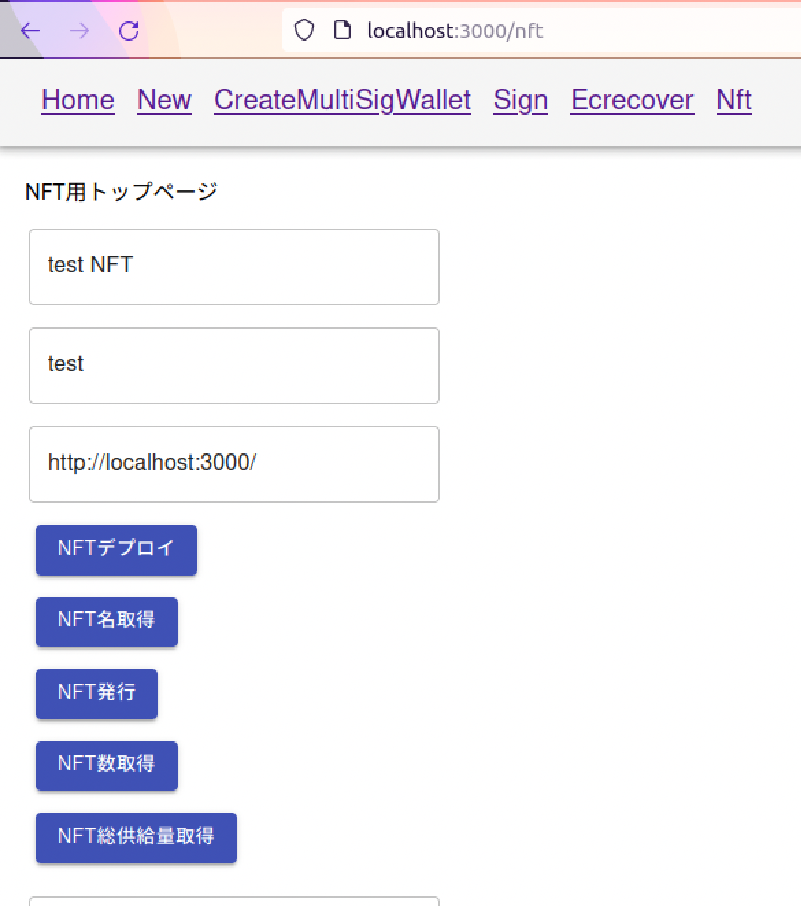
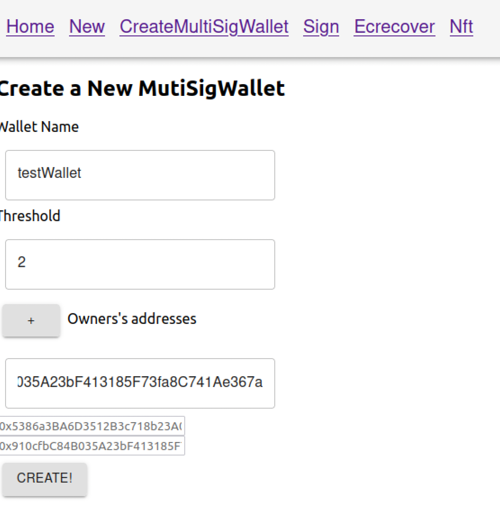
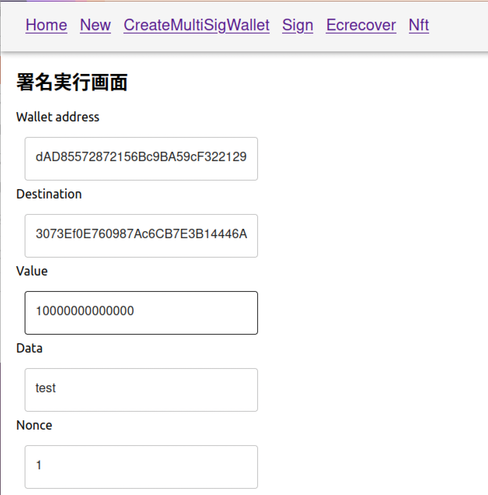
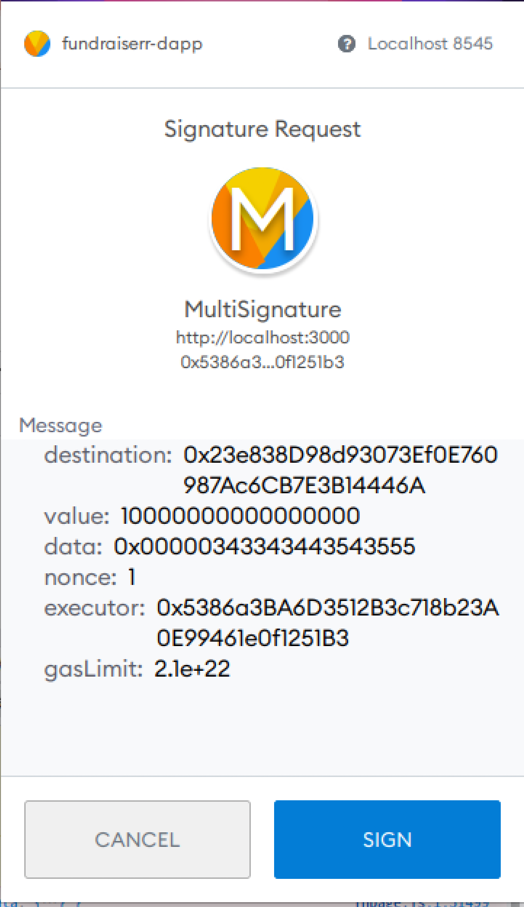
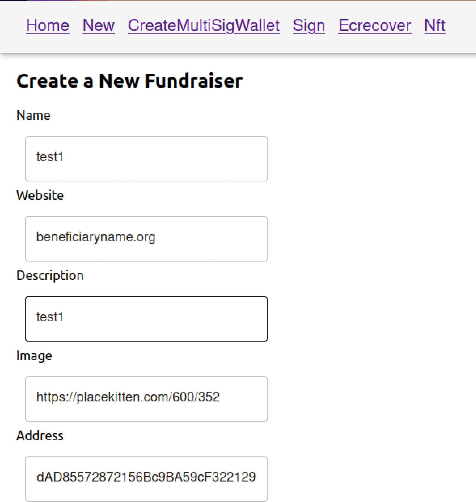
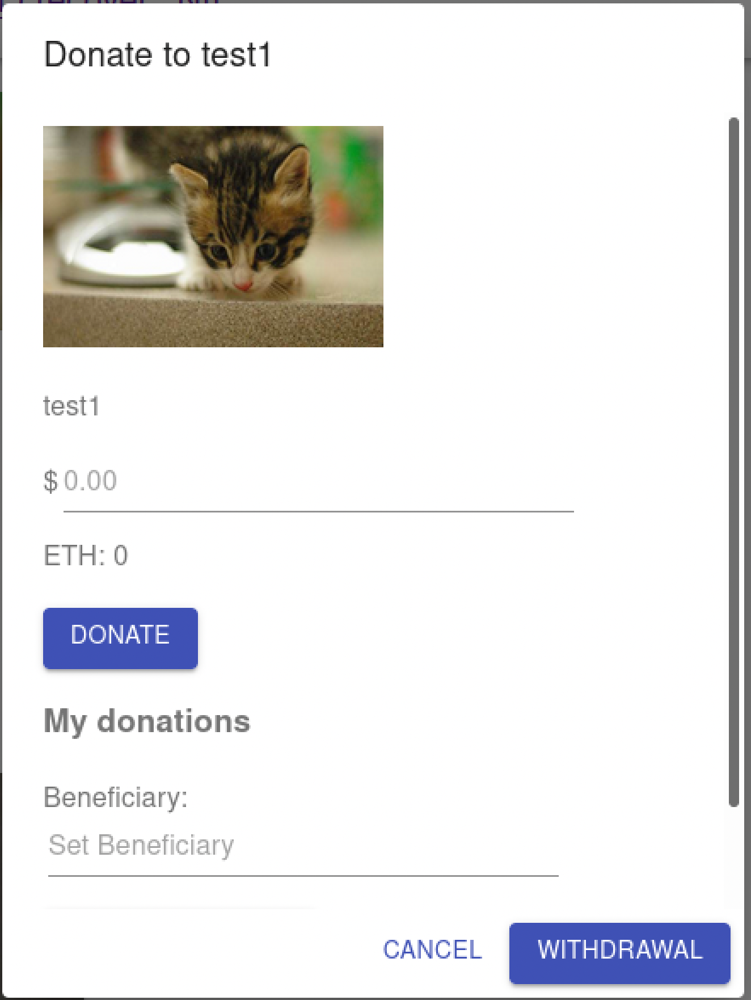
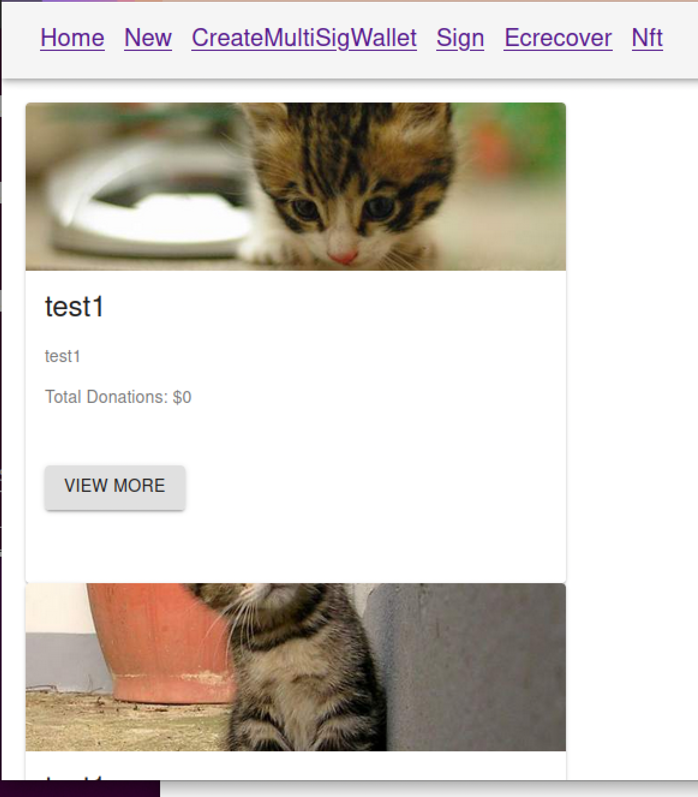

# Web3.0アプリケーションリポジトリ

MetaMaskとWeb3.js、スマートコントラクト(solidity)とReact.jsから構築されています。

土台部分については、下記コマンドにより生成

 `truffle unbox react`
 
solcのバージョン情報等については、truffle-config.jsを参照ください。

## 実装機能
   1. 資金調達関連機能： ほぼ実装済み(一部バグあり)  
   2. NFT関連機能： 発行機能のみ実装ずみ(他はバグがあるので今後修正)  
   3. マルチシグ関連機能： マルチシグウォレット生成＆署名機能実装済み  

## 今後実装予定機能
   1. ERC020規格のトークン発行関連機能  
   2. ゲーム関連機能  

## GitHub PagesのURL
   
   https://mashharuki.github.io/fundraiser-dapp/

## 主なディレクトリ構成
~~~
   root/  
   　┣ client/　: フロントエンド側のディレクトリ  
   　　　└ src/  ：App.jsなどのアプリを構成するファイルを格納するディレクトリ  
   　　　　 └ contracts/ : コンパイル済みのコントラクトjsonファイルを格納する   
   　　　　 └ fundraiser/ : 資金調達機能関連のコンポーネント用ディレクトリ  
   　　　　 └ nft/ : NFT関連のコンポーネント用ディレクトリ  
  　　　　  └ wallet/ : ウォレット関連のコンポーネント用ディレクトリ       
   　　　└  public/  : CSSファイルなど全体を通して使用するファイルを格納するディレクトリ   
   　　　└  node_modules/　: npmによってインストールするモジュール群を格納するディレクトリ  
   　　　└  package.json: 　npm用の設定ファイル  
   　　　└  package-lock.json:　 npm installによってインストールされたモジュールの情報を記載したファイル  
   　┣ contracts/　: スマートコントラクト(バックエンド側)のディレクトリ  
　　　   └ safeContracts/: マルチシグウォレット関連のコントラクトを格納したディレクトリ  
　　　　　　    └ base/ :  ベースとなるコントラクトを格納したディレクトリ  
　　　　　　    └ common/ : 共通機能コントラクトを格納したディレクトリ  
　　　　　　    └ external/ : 上限値チェック用のコントラクトを格納したディレクトリ     
　　　　　　    └ interfaces/ : インターフェース関連のコントラクト格納ディレクトリ    
   　┣ develop/　: 実装途中のファイルを格納するディレクトリ  
   　┣ migrations/　: デプロイ用のJsファイルを格納するディレクトリ  
   　┣ node_modules/　: npmによってインストールするモジュール群を格納するディレクトリ  
   　┣ test/　: スマートコントラクトのテストコードを格納するディレクトリ  
   　┣ img/　: 画像データを格納するディレクトリ   
   　┣ truffle-config.js: truffle用の設定ファイル  
   　┣ README.md: リポジトリの各種説明を記載   
   　┣ LICENSE: ライセンス情報を記載  
   　┣ package-lock.json: npm installによってインストールされたモジュールの情報を記載したファイル
~~~

## 画面例
### 1. NFT作成画面

### 2. マルチシグウォレット作成画面

### 3. 署名実行画面

### 4. 署名時のトランザクション

### 5. 資金調達企画作成画面

### 6. 資金調達確認画面

### 7. ホーム画面

***

## clientフォルダ直下で実行するコマンド
   `npm i`  
   `npm install -g mocha`  
   `npm install -g chai`   
   `npm install @openzeppelin/contracts`  
   `npm install --save react-router-dom`  

## テストコードを実行するコマンド(fundraiser-dappフォルダ直下で実行する)

`truffle test`

## コントラクトのコンパイルとデプロイ用のコマンド(ローカルチェーンの場合)
   `truffle compile`  
   `truffle migrate`  
   なお、マイグレーションしたいファイルを指定する場合は下記のように打ち込む  
   `truffle migrate --f 2 --to 3`  
   (client/contracts/ 配下に「コントラクト名.json」ができていれば成功。) 

## コントラクトのコンパイルとデプロイ用のコマンド(Rinkebyの場合)
   `truffle compile --network rinkeby`  
   `truffle migrate --network rinkeby`  
   (client/contracts/ 配下に「コントラクト名.json」ができていれば成功。) 

## 事前にやっておくこと

1. node.jsをインストールしておくこと  
2. ganacheをインストールして事前に起動しておくこと  
3. ganacheを使ってプライベートネット上にスマートコントラクトをデプロイすること  
4. デプロイしたコントラクトの情報が記載されているJSONファイルをclient/contractsフォルダ内にコピペする。(※重要)  
5. MetaMaskをインストールしておくこと  
6. プライベートネットの秘密鍵をMetaMaskにインポートしておくこと  

## 動かし方

準備ができたら、clientフォルダで下記コマンドを実行する。

`npm run start`  

http:localhost:3000/ にアクセスすると最初のページが表示されている。  

buildしたい場合は、次のコマンドを打つこと！  
`npm run build` 

## 主なエラーについて

1. `Error: VM Exception while processing transaction: revert`  
コントラクトファイルなどのrequire()文の条件に反しているなどが考えられるため、入力したアドレスなどを見直す。もしくは、require()文の条件を見直すこと。

2. `Error: VM Exception while processing transaction: invalid opcode`  
存在しない関数などを呼びだそうとしている時に発生するため、スペルや大文字小文字を確認する。

3. `Error: VM Exception while processing transaction: out of gas`  
gasが足りない時に発生するため、設定を見直すこと。send()メソッドを呼び出すときに、明示的にgasの量を指定すると治る。

### GitHub Actions設定(調整中)

1. CodeQL
2. Node.js CI

### 参考書籍&参考ページ

<a href="https://www.amazon.co.jp/Solidity%E3%81%A8Ethereum%E3%81%AB%E3%82%88%E3%82%8B%E5%AE%9F%E8%B7%B5%E3%82%B9%E3%83%9E%E3%83%BC%E3%83%88%E3%82%B3%E3%83%B3%E3%83%88%E3%83%A9%E3%82%AF%E3%83%88%E9%96%8B%E7%99%BA-%E2%80%95Truffle-Suite%E3%82%92%E7%94%A8%E3%81%84%E3%81%9F%E9%96%8B%E7%99%BA%E3%81%AE%E5%9F%BA%E7%A4%8E%E3%81%8B%E3%82%89%E3%83%87%E3%83%97%E3%83%AD%E3%82%A4%E3%81%BE%E3%81%A7-Kevin-Solorio/dp/4873119340">実践スマートコントラクト開発</a>

<a href="https://www.amazon.co.jp/%E8%A9%A6%E3%81%97%E3%81%A6%E5%AD%A6%E3%81%B6-%E3%82%B9%E3%83%9E%E3%83%BC%E3%83%88%E3%82%B3%E3%83%B3%E3%83%88%E3%83%A9%E3%82%AF%E3%83%88%E9%96%8B%E7%99%BA-%E5%8A%A0%E5%B5%9C-%E9%95%B7%E9%96%80/dp/4839966885">試して学ぶスマートコントラクト開発</a>

<a href="https://www.amazon.co.jp/%E3%83%9E%E3%82%B9%E3%82%BF%E3%83%AA%E3%83%B3%E3%82%B0%E3%83%BB%E3%82%A4%E3%83%BC%E3%82%B5%E3%83%AA%E3%82%A2%E3%83%A0-%E2%80%95%E3%82%B9%E3%83%9E%E3%83%BC%E3%83%88%E3%82%B3%E3%83%B3%E3%83%88%E3%83%A9%E3%82%AF%E3%83%88%E3%81%A8DApp%E3%81%AE%E6%A7%8B%E7%AF%89-Andreas-M-Antonopoulos/dp/4873118964/ref=pd_lpo_14_img_1/356-2037952-9878221?_encoding=UTF8&pd_rd_i=4873118964&pd_rd_r=09c92823-9be5-4bf0-b266-758aea774cea&pd_rd_w=jlAg1&pd_rd_wg=qolot&pf_rd_p=dc0198fa-c371-4787-b1e2-96ed0e4d45e8&pf_rd_r=W3F72XVVYG5J4E9RR5WV&psc=1&refRID=W3F72XVVYG5J4E9RR5WV">マスタリングイーサリアム</a>

<a href="https://www.amazon.co.jp/%E3%83%96%E3%83%AD%E3%83%83%E3%82%AF%E3%83%81%E3%82%A7%E3%83%BC%E3%83%B3-dapp-%E3%82%B2%E3%83%BC%E3%83%A0%E9%96%8B%E7%99%BA%E5%85%A5%E9%96%80-Solidity%E3%81%AB%E3%82%88%E3%82%8B%E3%82%A4%E3%83%BC%E3%82%B5%E3%83%AA%E3%82%A2%E3%83%A0%E5%88%86%E6%95%A3%E3%82%A2%E3%83%97%E3%83%AA%E3%83%97%E3%83%AD%E3%82%B0%E3%83%A9%E3%83%9F%E3%83%B3%E3%82%B0-Kedar/dp/4798159689/ref=sr_1_1?__mk_ja_JP=%E3%82%AB%E3%82%BF%E3%82%AB%E3%83%8A&dchild=1&keywords=dapp&qid=1619923227&s=books&sr=1-1">ブロックチェーン dapp&ゲーム開発入門 Solidityによるイーサリアム分散アプリプログラミング</a>

<a href="https://www.amazon.co.jp/%E3%81%84%E3%81%A1%E3%81%B0%E3%82%93%E3%82%84%E3%81%95%E3%81%97%E3%81%84%E3%83%96%E3%83%AD%E3%83%83%E3%82%AF%E3%83%81%E3%82%A7%E3%83%BC%E3%83%B3%E3%81%AE%E6%95%99%E6%9C%AC-%E4%BA%BA%E6%B0%97%E8%AC%9B%E5%B8%AB%E3%81%8C%E6%95%99%E3%81%88%E3%82%8B%E3%83%93%E3%83%83%E3%83%88%E3%82%B3%E3%82%A4%E3%83%B3%E3%82%92%E6%94%AF%E3%81%88%E3%82%8B%E4%BB%95%E7%B5%84%E3%81%BF-%E3%80%8C%E3%81%84%E3%81%A1%E3%81%B0%E3%82%93%E3%82%84%E3%81%95%E3%81%97%E3%81%84%E6%95%99%E6%9C%AC%E3%80%8D%E3%82%B7%E3%83%AA%E3%83%BC%E3%82%BA-%E6%9D%89%E4%BA%95%E9%9D%96%E5%85%B8/dp/4295001449/ref=pd_lpo_1?pd_rd_i=4295001449&psc=1">いちばんやさしいブロックチェーンの教本 人気講師が教えるビットコインを支える仕組み</a>

<a href="https://www.amazon.co.jp/%E5%9B%B3%E8%A7%A3%E5%8D%B3%E6%88%A6%E5%8A%9B-%E3%83%96%E3%83%AD%E3%83%83%E3%82%AF%E3%83%81%E3%82%A7%E3%83%BC%E3%83%B3%E3%81%AE%E3%81%97%E3%81%8F%E3%81%BF%E3%81%A8%E9%96%8B%E7%99%BA%E3%81%8C%E3%81%93%E3%82%8C1%E5%86%8A%E3%81%A7%E3%81%97%E3%81%A3%E3%81%8B%E3%82%8A%E3%82%8F%E3%81%8B%E3%82%8B%E6%95%99%E7%A7%91%E6%9B%B8-%E3%82%B3%E3%83%B3%E3%82%BB%E3%83%B3%E3%82%B5%E3%82%B9%E3%83%BB%E3%83%99%E3%82%A4%E3%82%B9%E6%A0%AA%E5%BC%8F%E4%BC%9A%E7%A4%BE/dp/4297106361">図解即戦力 ブロックチェーンのしくみと開発がこれ1冊でしっかりわかる教科書</a>

<a href="https://www.amazon.co.jp/%E7%B5%B5%E3%81%A7%E8%A6%8B%E3%81%A6%E3%82%8F%E3%81%8B%E3%82%8B%E3%83%96%E3%83%AD%E3%83%83%E3%82%AF%E3%83%81%E3%82%A7%E3%83%BC%E3%83%B3%E3%81%AE%E4%BB%95%E7%B5%84%E3%81%BF-%E7%B1%B3%E6%B4%A5-%E6%AD%A6%E8%87%B3/dp/4798158860/ref=pd_lpo_2?pd_rd_i=4798158860&psc=1">絵で見てわかるブロックチェーンの仕組み</a>

<a href="https://metamask.io/">METAMASK</a>

<a href="https://addons.mozilla.org/ja/firefox/addon/metamask-legacy-web3/">METAMASK Legacy Web3</a>

<a href="https://infura.io/docs/ethereum">INFURA</a>

<a href="https://www.trufflesuite.com/boxes">truffleの公式ページ</a>

<a href="https://hardhat.org/">hardhatの公式ページ</a>

<a href="https://www.rinkeby.io/#faucet">Rinkeby Faucet</a>

<a href="https://wallet.gnosis.pm/#/wallets">マルチシグウォレットのデモページ</a>

<a href="https://remix.ethereum.org/">REMIX IDE</a>

<a href="https://www.myetherwallet.com/">myEthWallet</a>

<a href="https://docs.openzeppelin.com/contracts/4.x/api/token/erc721">OpenZeppelin Docs</a>

<a href="https://gnosis-safe.io/">safe contractsの公式ページ</a>

<a href="https://docs.gnosis.io/safe/docs/contracts_deployment/">safe contractsについての紹介ページ</a>

<a href="https://github.com/gnosis/safe-contracts/tree/main/contracts">safe contractsのGitHub</a>

<a href="https://blog.mktia.com/solve-the-error-vm-exception/">Error対処法</a>