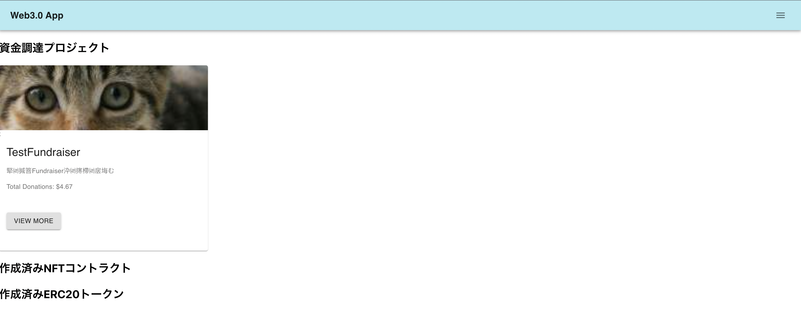
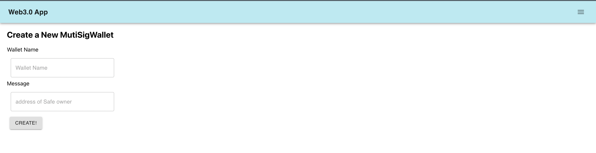
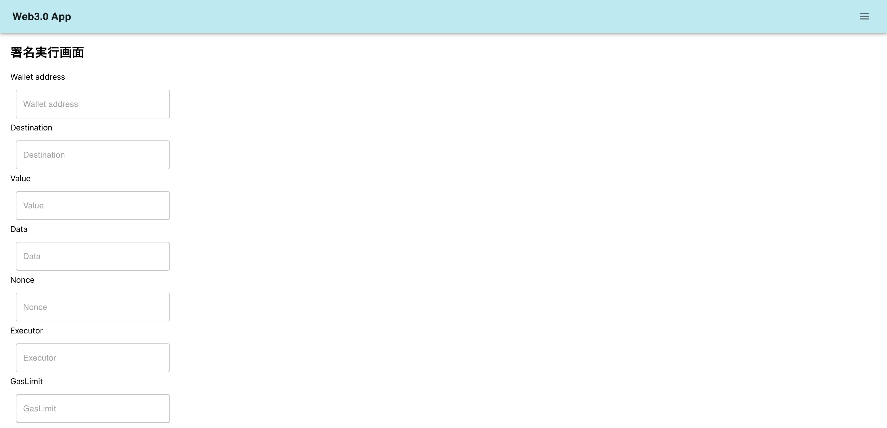
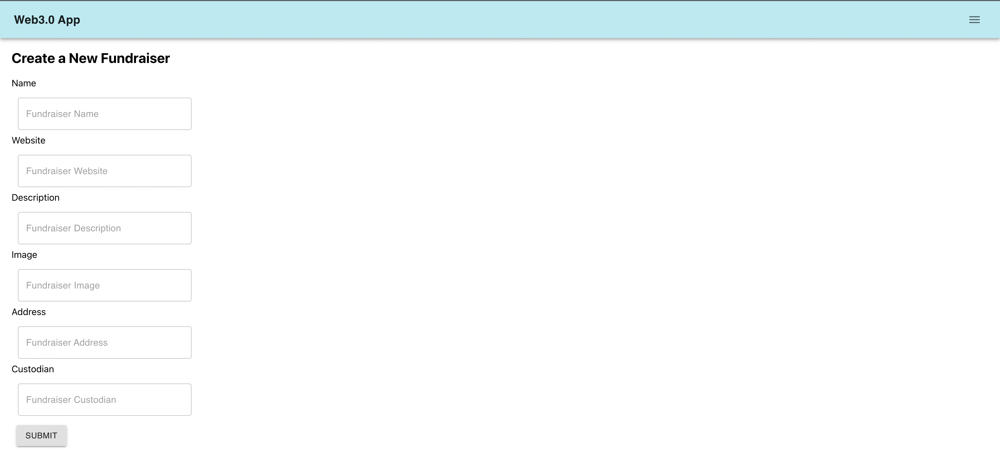
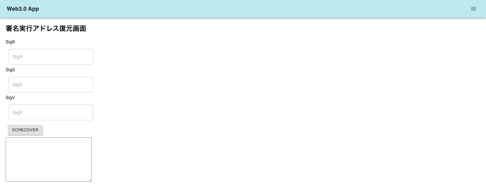
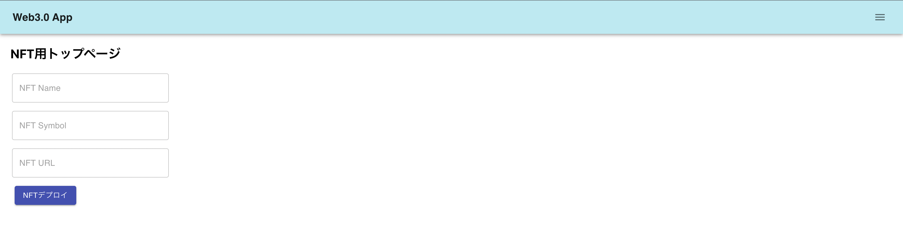
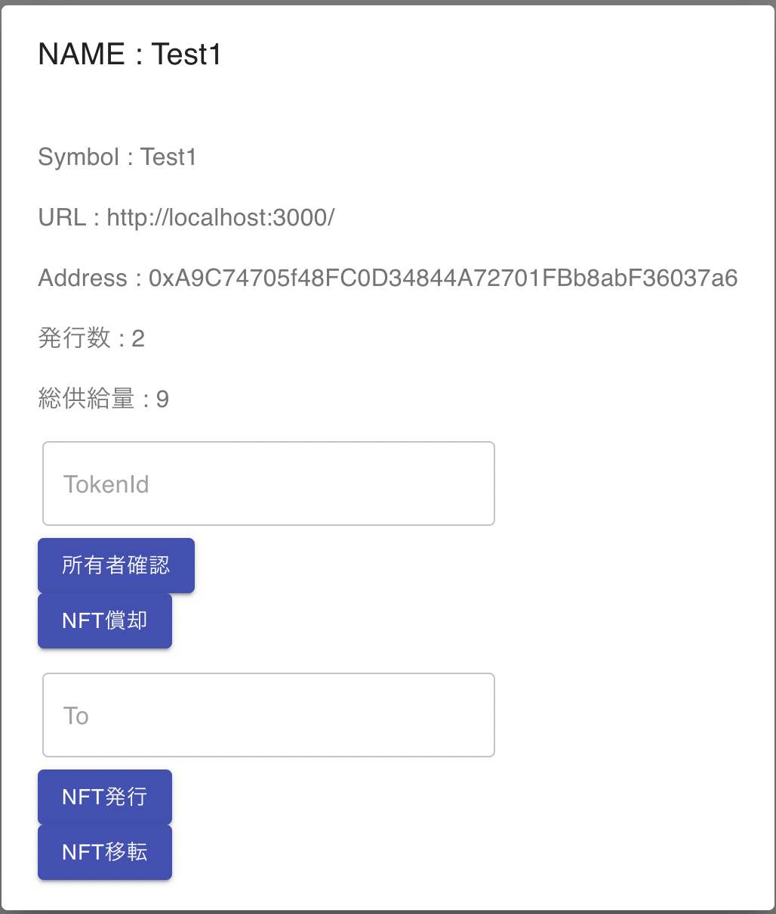
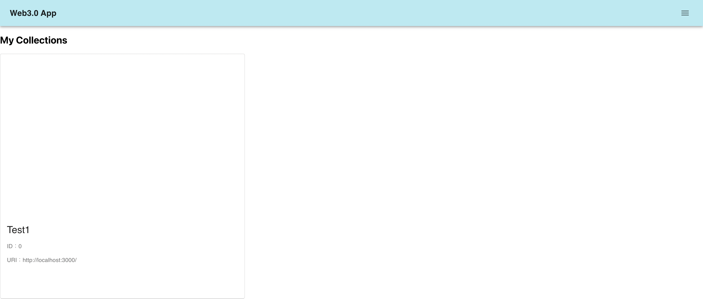
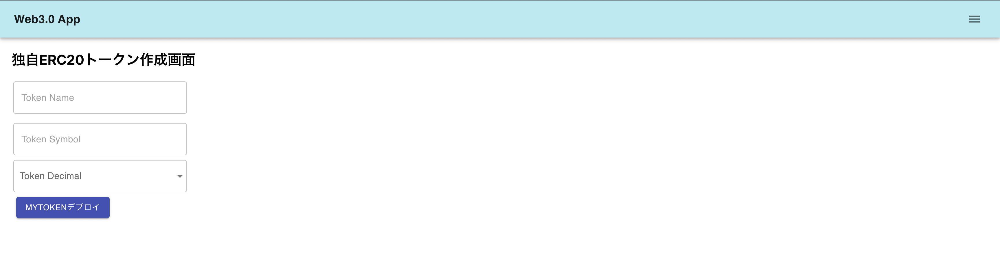
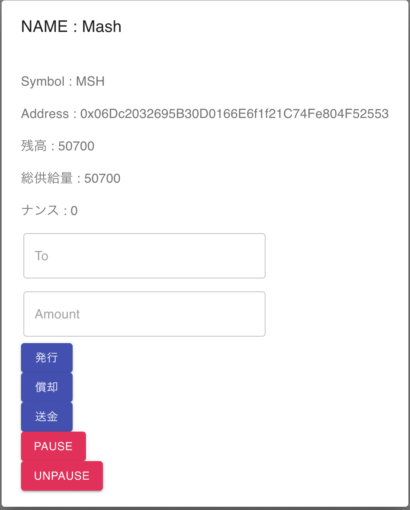

# Web3.0アプリケーションリポジトリ

MetaMaskとWeb3.js、スマートコントラクト(solidity)とReact.jsから構築されています。

土台部分については、下記コマンドにより生成

 `truffle unbox react`
 
solcのバージョン情報等については、truffle-config.jsを参照ください。

## 実装機能
   1. 資金調達関連機能： 実装済み
   2. NFT関連機能： NFTコントラクトは実装ずみ(Collection表示機能はバグがあるので今後修正)  
   3. マルチシグ関連機能： マルチシグウォレット生成＆署名機能実装済み  
   4. ERC020規格のトークン発行関連機能   

## 今後実装予定機能
   2. ゲーム関連機能  

## GitHub PagesのURL
   
   https://mashharuki.github.io/fundraiser-dapp/

## 開発に使用しているフレームワークなどの情報について

|名称|内容|
|-------------|-------------|
|truffle|スマートコントラクト開発用のフレームワークとして使用している。テストやデプロイを行う。|
|React|フロントエンド側の開発をするために使用している。|
|Material-UI(MUI)|React向けのUIコンポーネントライブラリ|
|Open Zeppelin|solidity用のフレームワーク|

## 主なディレクトリ構成
~~~
   root/  
   　┣ client/　: フロントエンド側のディレクトリ  
   　|　　┣ src/  ：App.jsなどのアプリを構成するファイルを格納するディレクトリ  
   　|　　|　 ┣ contracts/ : コンパイル済みのコントラクトjsonファイルを格納する   
   　|　　|　 ┣ fundraiser/ : 資金調達機能関連のコンポーネント用ディレクトリ  
   　|　　|　 ┣ mytoken/ : ERC20トークン関連のコンポーネント用ディレクトリ
   　|　　|　 ┣ nft/ : NFT関連のコンポーネント用ディレクトリ  
  　 |　　|　 └ wallet/ : ウォレット関連のコンポーネント用ディレクトリ      
   　|　　┣  public/  : CSSファイルなど全体を通して使用するファイルを格納するディレクトリ   
   　|　　┣  node_modules/　: npmによってインストールするモジュール群を格納するディレクトリ  
   　|　　┣  package.json: 　npm用の設定ファイル  
   　|　　└  package-lock.json:　 npm installによってインストールされたモジュールの情報を記載したファイル  
   　┣ contracts/　: スマートコントラクト(バックエンド側)のディレクトリ  
   　|　　┣ common/: 共通で使用するスマートコントラクトを格納したディレクトリ  
   　|　　┣ ERC20/: ERC20トークン関連のコントラクトを格納したディレクトリ
   　|　　┣ safeContracts/: マルチシグウォレット関連のコントラクトを格納したディレクトリ  
   　|　　|　    ┣ base/ :  ベースとなるコントラクトを格納したディレクトリ  
   　|　　|　    ┣ common/ : 共通機能コントラクトを格納したディレクトリ  
   　|　　|　    ┣ external/ : 上限値チェック用のコントラクトを格納したディレクトリ     
   　|　　|　    ┣ interfaces/ : インターフェース関連のコントラクト格納ディレクトリ 
   　|　　|　    └ proxies/ : proxyコントラクト関連の格納ディレクトリ
   　|　　└ oracles/ : オラクル処理関連のコントラクト格納ディレクトリ
   　┣ develop/　: 実装途中のファイルを格納するディレクトリ  
   　┣ migrations/　: デプロイ用のJsファイルを格納するディレクトリ  
   　┣ node_modules/　: npmによってインストールするモジュール群を格納するディレクトリ  
   　┣ test/　: スマートコントラクトのテストコードを格納するディレクトリ  
   　┣ img/　: 画像データを格納するディレクトリ   
   　┣ truffle-config.js: truffle用の設定ファイル  
   　┣ README.md: リポジトリの各種説明を記載  
   　┣ README2.md: オラクル処理の各種説明を記載 
   　┣ LICENSE: ライセンス情報を記載  
   　└ package-lock.json: npm installによってインストールされたモジュールの情報を記載したファイル
~~~

## 参考になりそうな前提知識
### 1. fallback()関数
    呼び出したコントラクトに存在しない関数を指定した場合に呼ばれる関数
    proxy patternではこの関数をうまく利用する。

### 2. solidity assembly (アセンブリ言語での記述方法)
    コード内にアセンブリ言語を使用できるインラインアセンブリがある。
    データサイズを意識することでガスを節約することが可能になります。
    
   <code>

    assembly {   
      let result := add(x, y)
      mstore(0x0, result)
      return(0x0, 32)
    }
   </code>
     
### 3. proxy pattern
    スマートコントラクトは一度デプロイすると変更できないが、
    上記のfallback関数の考え方を応用し、コントラクトを
    proxyコントラクトとlogicコントラクトに分ける開発方法のこと。
    これにより一度デプロイした後でも呼び出すコントラクトを更新することが
    可能となる。

### 4. Method ID
    solidityではコントラクトから他のコントラクトの関数を実行する際に、Method IDをFunction Selectorに渡して実行する。
    関数名と引数の型の文字列をkeccak256でハッシュ化し、頭の4byteを取ったものがMethod IDになります。
    
    算出例：
      bytes4(keccak256("setNum(uint256)") = 0xcd16ecbf
    
### 5. calldata
    callまたはdelegatecallで別のコントラクトを呼び出した時に使用するデータ領域です。
    calldataは、Method IDと引数(32bytes)を合わせたデータのこと。
    
### 6. セキュリティチェックの重要性
    スマートコントラクトは、基本的には一度デプロイしたら後から内容を変更することはできない。  
    (proxy patternの用に擬似的に変更することは可能。)  
    そのため、デプロイ前にテストや専門企業に監査を実施してもらうことがで非常に重要となる。  
    また、OpenZeppelinが発表しているような安全なライブラリを使って開発することが重要となる。  
    <a href="https://ecouffes.github.io/smart-contract-best-practices/security_tools/">Ethereum Smart Contract Best Practices</a>などのベストプラクティスなどを  
    参考にして開発を進めると良いと考えている。

### 7. ABI(Application Binary Interface)
    ABIとは、バイナリーファイル(実行形式ファイル)へのアクセスに対して互換性を与えるもの。  
    スマートコントラクトは、EVM上で実行可能なバイナリーファイルとなっており、コンパイル時に生成されるJSONファイルにはReact.jsなどを利用して構築されたクライアントアプリからWeb3.jsなどのライブラリをTransactionを介してやり取りを行う方法について互換性を与えるための定義が記述されている。この中身は、コントラクトの機能を外部から呼び出すための標準化された方法が記述されており、ether.jsやweb3.jsなどのライブラリがABIに準拠したデータ構造で呼び出しを行うことで。ブロックチェーン上にあるコントラクトの任意の機能にアクセスすることができる。

### 8. EVM (イーサリアム仮想マシン)
    solidityなどの高級言語で記述されたソースコードをイーサリアム上でも実行できるバイトコードに変換する翻訳機のこと。  
    コントラクトコードはこのEVMを介して実行される。(逆にEVM互換性があればイーサリアムでなくともsolidityで記述したスマートコントラクトをマイグレーションすることができる。Astar Network等)

## 画面例
### 1. ホーム画面


### 2. マルチシグウォレット作成画面


### 3. 署名実行画面


### 4. 署名時のトランザクション


### 5. 資金調達企画作成画面


### 6. 資金調達確認画面


### 7. 署名アドレス復元画面


### 8. NFT作成画面


### 9. NFTコントラクトの例 


### 10. NFTコレクション画面(改修中)


### 11. 独自トークン作成画面


### 12. 独自トークンの例


***

## clientフォルダ直下で実行するコマンド
   `npm i`  
   `npm install -g mocha`  
   `npm install -g chai`   
   `npm install @openzeppelin/contracts`  
   `npm install --save react-router-dom`  
   `npm i @chainlink/contracts`  

## npm updateの例(reactをv16⇨v17に上げるコマンド)
   `npm update react@17.0.2 react-dom@17.0.2 react-router-dom@6.0.1`

## テストコードを実行するコマンド(fundraiser-dappフォルダ直下で実行する)

   `truffle test`

うまくいけば下記の様に全てのテスト項目がpassされる。(2022年5月7日時点)  
※ テスト項目については、不足している箇所がある。

```
 Contract: FundraiserFactory: deployment
    ✓ has been deployde (64ms)

  Contract: FundraiserFactory: createfundraiser
    ✓ increments the fundraisersCount (203ms)
    ✓ emits the FundraiserCreated event (148ms)

  Contract: FundraiserFactory: fundraisers
    when fundraisers collection is empty
      ✓ returns an empty collection (63ms)
    varying limits
      ✓ returns 10 results when limit requested is 10
      - returns 20 results when limit requested is 20
      - returns 20 results when limit requested is 30
    varying offset
      ✓ contains the fundraiser with the appropriate offset
      - contains the fundraiser with the appropriate offset
    boundary conditions
      ✓ raises out of bounds error (156ms)
      ✓ adjusts return size to prevent out of bounds error

  Contract: Fundraiser
    initialization
      ✓ gets the beneficiary name
      ✓ gets the beneficiary url
      ✓ gets the beneficiary imageURL
      ✓ gets the beneficiary description
      ✓ gets the beneficiary description
      ✓ gets the owner
    setBeneficiary
      ✓ updated beneficiary when called by owner account (46ms)
      ✓ throws an error when called from a non-owner account
    making donations
      ✓ increases myDonationsCount (57ms)
      ✓ include donation in myDonations (43ms)
      ✓ increase the totalDonations amount (69ms)
      ✓ increase donationsCount (69ms)
      ✓ emit the DonationReceived event (48ms)
    withdrawing funds
      ✓ transfers balance to beneficiary (46ms)
      ✓ emit Withdraw event
      withdrawing funds
        access controls
          ✓ throws an error when called from a non-owner account
          ✓ permits the owner to call the function
    fallback function
      ✓ increase the totalDonations amount
      ✓ increase donationsCount (57ms)

  Contract: MultiSigFactory: deployment
    ✓ has been deployde (64ms)

  Contract: MultiSigFactory: create MultiSigWallet
    ✓ increments the mutliSigWalletsCount

  Contract: MyTokenFactory: deployment
    ✓ has been deployde (63ms)

  Contract: MyTokenFactory: create MyToken
    ✓ increments the MyTokenCount (225ms)

  Contract: MyTokenFactory: MyTokens
    when MyTokens collection is empty
      ✓ returns an empty collection (175ms)
    varying limits
      ✓ returns 10 results when limit requested is 10
      ✓ returns 20 results when limit requested is 20
      ✓ returns 20 results when limit requested is 30
    varying offset
      ✓ contains MyToken with the appropriate offset
      ✓ contains MyToken with the appropriate offset (40ms)
    boundary conditions
      ✓ raises out of bounds error
      ✓ adjusts return size to prevent out of bounds error

  Contract: NFTFactory: deployment
    ✓ has been deployde (67ms)

  Contract: NFTFactory: create NFT
    ✓ increments the NFTCount (325ms)

  Contract: NFTFactory: nfts
    when NFTs collection is empty
      ✓ returns an empty collection (620ms)
    varying limits
      ✓ returns 10 results when limit requested is 10
      - returns 20 results when limit requested is 20
      - returns 20 results when limit requested is 30
    varying offset
      ✓ contains NFT with the appropriate offset (268ms)
      - contains NFT with the appropriate offset
    boundary conditions
      ✓ raises out of bounds error
      - adjusts return size to prevent out of bounds error

  Contract: NFT test
    initialization
      ✓ gets the NFT name
      ✓ gets the NFT symbol (163ms)
      ✓ gets the NFT imageURL
    mint test
      ✓ mint NFT (568ms)
    indexing
   NFT lists: [
      'data:application/json;base64,eyJuYW1lIjoiTWFzaCIsImRlc2NyaXB0aW9uIjoiVGhpcyBORlQgaXMgYSB0ZXN0ISEiLCJVUkwiOiJodHRwczovL3BsYWNla2l0dGVuLmNvbS82MDAvMzUwIn0=',
      'data:application/json;base64,eyJuYW1lIjoiTWFzaCIsImRlc2NyaXB0aW9uIjoiVGhpcyBORlQgaXMgYSB0ZXN0ISEiLCJVUkwiOiJodHRwczovL3BsYWNla2l0dGVuLmNvbS82MDAvMzUwIn0=',
      'data:application/json;base64,eyJuYW1lIjoiTWFzaCIsImRlc2NyaXB0aW9uIjoiVGhpcyBORlQgaXMgYSB0ZXN0ISEiLCJVUkwiOiJodHRwczovL3BsYWNla2l0dGVuLmNvbS82MDAvMzUwIn0='
   ]
      ✓ lists NFT (1050ms)

  50 passing (44s)
  7 pending
``` 

## コントラクトのコンパイルとデプロイ用のコマンド(ローカルチェーンの場合)
   `truffle compile`  
   `truffle migrate --network develop`  
   なお、マイグレーションしたいファイルを指定する場合は下記のように打ち込む  
   <b>※ M1 チップ搭載のMacBookで実行する場合は、sudoをつけて実行すること</b>

   `truffle migrate --f 2 --to 3`  
   (client/contracts/ 配下に「コントラクト名.json」ができていれば成功。) 

## コントラクトのコンパイルとデプロイ用のコマンド(Rinkebyの場合)
   `truffle compile --network rinkeby`  
   `truffle migrate --network rinkeby`  
   (client/contracts/ 配下に「コントラクト名.json」ができていれば成功。) 

### Rinkebyなどのテストネット上にデプロイする前にやるべきこと
   1. ニーモニックコード用の環境変数を.envファイルに追記する。  
      `MNEMONIC="<自分のMetaMaskのニーモニックフレーズ>"`
   2. INFURAのプロジェクトID用の環境変数を.envファイルに追記する。  
      `INFURA_PROJECT_ID=<自分のINFURAプロジェクトID>`
   3. truffle-config.jsにrinkeby用のネットワーク設定を追加する。

   ```js
      // 必要なモジュールをインポート
      require('dotenv').config();
      const HDWalletProvider = require('truffle-hdwallet-provider');

      // Rinkeby用
      rinkeby: {
         provider: () => {
            const mnenonic = process.env.MNEMONIC;
            const project_id = process.env.INFURA_PROJECT_ID;
            return new HDWalletProvider(
               mnenonic,
               `https://rinkeby.infura.io/v3/${project_id}`
            );
         },
         network_id: 4,
      },
   ```

### MyTokenをデプロイする場合
    @openzeppelin/contracts配下の「ERC20.sol」ファイルに少し修正が必要。

   <strong>修正点1</strong>
   ```
     // 変数を追加 
     uint8 private _decimals;
   ```

   <strong>修正点2</strong>
   ```
     // コンストラクターの定義を変更する。
     constructor(string memory name_, string memory symbol_, uint8 decimals_) {
        _name = name_;
        _symbol = symbol_;
        // 桁数を設定する。
        _setupDecimal(decimals_);
      }
   ```
   <strong>修正点3</strong>
   ```
     // 桁数を変更するためのメソッドを追加する。
     /**
      * 小数点桁数を設定するための関数
      * @param value 設定する桁数
      */
      function _setupDecimal(uint8 value) internal {
         _decimals = value;
      }
   ```

### hardhatを使ってビルドとデプロイを行う場合
   「backend/hardhat」配下で下記コマンドを実行  
   1. `npx hardhat compile`
   2. `npx hardhat run scripts/deploy.js --network rinkeby`

   デプロイに成功する下記のようなものがコンソール上に表示される
   ```bash
      FundraiserFactory deployed to: 0x174387193854254F0d7bB7808EF36D6FeeffCdbf
   ```

### Rinkebyにデプロイしたコントラクトのアドレス
   1. FundraiserFactory: 0x174387193854254F0d7bB7808EF36D6FeeffCdbf
   2. 

## 事前にやっておくこと

1. node.jsをインストールしておくこと  
2. ganacheをインストールして事前に起動しておくこと  
3. ganacheを使ってプライベートネット上にスマートコントラクトをデプロイすること  
4. デプロイしたコントラクトの情報が記載されているJSONファイルをclient/contractsフォルダ内にコピペする。(※重要)  
5. MetaMaskをインストールしておくこと  
6. プライベートネットの秘密鍵をMetaMaskにインポートしておくこと  

## 動かし方(クライアントサイドから実行する場合)

準備ができたら、clientフォルダで下記コマンドを実行する。

`npm run start`  

http:localhost:3000/ にアクセスすると最初のページが表示されている。  

## 動かし方(サーバーサイドから実行する場合)

準備ができたら、backendディレクトリ直下で下記コマンドを実行する。

`node server.js`

http:localhost:3001/ にアクセスすると最初のページが表示されている。  

## ビルド方法

buildしたい場合は、次のコマンドを打つこと！  
`npm run build` 

うまくいっていれば、client/buildディレクトリ配下にビルドの成果物が出力されている。

## 主なエラーについて

1. `Error: VM Exception while processing transaction: revert`  
コントラクトファイルなどのrequire()文の条件に反しているなどが考えられるため、入力したアドレスなどを見直す。もしくは、require()文の条件を見直すこと。

2. `Error: VM Exception while processing transaction: invalid opcode`  
存在しない関数などを呼びだそうとしている時に発生するため、スペルや大文字小文字を確認する。

3. `Error: VM Exception while processing transaction: out of gas`  
gasが足りない時に発生するため、設定を見直すこと。send()メソッドを呼び出すときに、明示的にgasの量を指定すると治る。

※SafeContractのエラー詳細についてはこちらを<a href="https://github.com/gnosis/safe-contracts/blob/main/docs/error_codes.md">参照</a>。

4. `Error: Could not find artifacts for Migrations from any sources`
  コントラクトデプロイ時にコントラクトが見つからないと行っている・・  
  2022年4月19日現在、rinkebyとgoerliにデプロイしようとするとこのエラーが出る。  
  ローカルのブロックチェーンにデプロイする時には問題なくできるが原因はわからず。。

### Rinkebyへのデプロイの記録

```
9_deploy_myToken_factory.js
===========================

   Deploying 'MyTokenFactory'
   --------------------------
   > transaction hash:    0x07f51fc1acc33c549076a841e090e5b7f9fa137a7864db028aa09e244e69b651
   > Blocks: 0            Seconds: 5
   > contract address:    0x569e692993BfB66304Edb5aCB5B4e18c8A77Bcb4
   > block number:        10433154
   > block timestamp:     1648887649
   > account:             0x51908F598A5e0d8F1A3bAbFa6DF76F9704daD072
   > balance:             144.757575357593868517
   > gas used:            2781469 (0x2a711d)
   > gas price:           20 gwei
   > value sent:          0 ETH
   > total cost:          0.05562938 ETH

2_deploy_fundraiser_factory.js
==============================

  Deploying 'FundraiserFactory'
   -----------------------------
   > transaction hash:    0x0416925ce57bff0d948c3f01506602e9e6f46999ae87736bedec65f5e0a618f6
   > Blocks: 2            Seconds: 21
   > contract address:    0xA2828D0Ea000B7098a6D1b6Ff31A97a3421464E1
   > block number:        10433170
   > block timestamp:     1648887889
   > account:             0x51908F598A5e0d8F1A3bAbFa6DF76F9704daD072
   > balance:             144.732332497593868517
   > gas used:            1262143 (0x13423f)
   > gas price:           20 gwei
   > value sent:          0 ETH
   > total cost:          0.02524286 ETH
```

全てのコントラクトのデプロイ記録

```bash
Starting migrations...
======================
> Network name:    'rinkeby'
> Network id:      4
> Block gas limit: 30000000 (0x1c9c380)


1_deploy_fundraiser_factory.js
==============================

   Deploying 'FundraiserFactory'
   -----------------------------
   > transaction hash:    0xdc61fbdfcc44d8aa5228dba32500d572d4dc5e624d955b58f9601147f8ffb87f
   > Blocks: 1            Seconds: 13
   > contract address:    0x72d3965a203fe5fCb70d20de6B71fFcAa2Ef500D
   > block number:        11273553
   > block timestamp:     1661570487
   > account:             0x51908F598A5e0d8F1A3bAbFa6DF76F9704daD072
   > balance:             155.115861757834481895
   > gas used:            1262155 (0x13424b)
   > gas price:           1.500000011 gwei
   > value sent:          0 ETH
   > total cost:          0.001893232513883705 ETH

   Pausing for 2 confirmations...
   ------------------------------
   > confirmation number: 1 (block: 11273554)
   > confirmation number: 2 (block: 11273555)
   > Saving artifacts
   -------------------------------------
   > Total cost:     0.001893232513883705 ETH


2_deploy_NFT_factory.js
=======================

   Deploying 'NFTFactory'
   ----------------------
   > transaction hash:    0xc84e5af0a6b1938ee4d43bd6d378d45592ce451722149fadc9b9cb3937bf3adb
   > Blocks: 1            Seconds: 9
   > contract address:    0xC9E2718b4916D957E0d3cc1253cce8ce91066bFC
   > block number:        11273556
   > block timestamp:     1661570532
   > account:             0x51908F598A5e0d8F1A3bAbFa6DF76F9704daD072
   > balance:             155.110621107296050458
   > gas used:            3493767 (0x354f87)
   > gas price:           1.500000011 gwei
   > value sent:          0 ETH
   > total cost:          0.005240650538431437 ETH

   Pausing for 2 confirmations...
   ------------------------------
   > confirmation number: 1 (block: 11273557)
   > confirmation number: 2 (block: 11273558)
   > Saving artifacts
   -------------------------------------
   > Total cost:     0.005240650538431437 ETH


3_deploy_multiSig_factory.js
============================

   Deploying 'MultiSigFactory'
   ---------------------------
   > transaction hash:    0x155f400c127f45fe15485067a55eb058e503184b6b1fed955278c311fc0a41c3
   > Blocks: 1            Seconds: 9
   > contract address:    0xFF287b132eFACB0EED2067fD8E1079041fd3c9Fe
   > block number:        11273559
   > block timestamp:     1661570577
   > account:             0x51908F598A5e0d8F1A3bAbFa6DF76F9704daD072
   > balance:             155.108955415783835387
   > gas used:            1110461 (0x10f1bd)
   > gas price:           1.500000011 gwei
   > value sent:          0 ETH
   > total cost:          0.001665691512215071 ETH

   Pausing for 2 confirmations...
   ------------------------------
   > confirmation number: 1 (block: 11273560)
   > confirmation number: 2 (block: 11273561)
   > Saving artifacts
   -------------------------------------
   > Total cost:     0.001665691512215071 ETH


4_deploy_safeContract_factory.js
================================

   Deploying 'SafeContractFactory'
   -------------------------------
   > transaction hash:    0xef7fd00100a493c65ebffac7f9254d78549ea8b853a11c8cc0ad468aa3b18ac1
   > Blocks: 2            Seconds: 21
   > contract address:    0xeBd4B2c48C163cC30CDCaCe3B9b2237c7248a4f2
   > block number:        11273563
   > block timestamp:     1661570637
   > account:             0x51908F598A5e0d8F1A3bAbFa6DF76F9704daD072
   > balance:             155.104002172747511605
   > gas used:            3302162 (0x326312)
   > gas price:           1.500000011 gwei
   > value sent:          0 ETH
   > total cost:          0.004953243036323782 ETH

   Pausing for 2 confirmations...
   ------------------------------
   > confirmation number: 1 (block: 11273564)
   > confirmation number: 2 (block: 11273565)
   > Saving artifacts
   -------------------------------------
   > Total cost:     0.004953243036323782 ETH


5_deploy_safeContractProxy_factory.js
=====================================

   Deploying 'GnosisSafeProxyFactory'
   ----------------------------------
   > transaction hash:    0x7b4ea13c7e015319ca01cd33184fc9149b3811693721baaca186ae64216a4328
   > Blocks: 0            Seconds: 9
   > contract address:    0x4e3c709CEB954a649D84C2d2f5B59B99254e6fd6
   > block number:        11273566
   > block timestamp:     1661570682
   > account:             0x51908F598A5e0d8F1A3bAbFa6DF76F9704daD072
   > balance:             155.102823696238869444
   > gas used:            785651 (0xbfcf3)
   > gas price:           1.500000011 gwei
   > value sent:          0 ETH
   > total cost:          0.001178476508642161 ETH

   Pausing for 2 confirmations...
   ------------------------------
   > confirmation number: 1 (block: 11273567)
   > confirmation number: 2 (block: 11273568)
   > Saving artifacts
   -------------------------------------
   > Total cost:     0.001178476508642161 ETH


6_deploy_myToken_factory.js
===========================

   Deploying 'MyTokenFactory'
   --------------------------
   > transaction hash:    0x4dbb3e85bf0dcaef34253cf8fc511c85a1672073b2d58cad08829ad8dbca02fb
   > Blocks: 1            Seconds: 9
   > contract address:    0x5C0ae4f8d50F5Cf4B21e1dd84fc58DA5160c62B4
   > block number:        11273569
   > block timestamp:     1661570727
   > account:             0x51908F598A5e0d8F1A3bAbFa6DF76F9704daD072
   > balance:             155.098651492711054754
   > gas used:            2781469 (0x2a711d)
   > gas price:           1.50000001 gwei
   > value sent:          0 ETH
   > total cost:          0.00417220352781469 ETH

   Pausing for 2 confirmations...
   ------------------------------
   > confirmation number: 1 (block: 11273570)
   > confirmation number: 2 (block: 11273571)
   > Saving artifacts
   -------------------------------------
   > Total cost:     0.00417220352781469 ETH


Summary
=======
> Total deployments:   6
> Final cost:          0.019103497637310846 ETH
```
=======
### DBの起動方法(PostgresSQLの場合)
 #### 1.1. macOS の場合
 #### 起動
   `brew services start postgresql`

 #### 停止
   `brew services stop postgresql`

### GitHub Actions設定(調整中)

1. CodeQL
2. Node.js CI

### 参考書籍&参考ページ

<a href="https://www.amazon.co.jp/Solidity%E3%81%A8Ethereum%E3%81%AB%E3%82%88%E3%82%8B%E5%AE%9F%E8%B7%B5%E3%82%B9%E3%83%9E%E3%83%BC%E3%83%88%E3%82%B3%E3%83%B3%E3%83%88%E3%83%A9%E3%82%AF%E3%83%88%E9%96%8B%E7%99%BA-%E2%80%95Truffle-Suite%E3%82%92%E7%94%A8%E3%81%84%E3%81%9F%E9%96%8B%E7%99%BA%E3%81%AE%E5%9F%BA%E7%A4%8E%E3%81%8B%E3%82%89%E3%83%87%E3%83%97%E3%83%AD%E3%82%A4%E3%81%BE%E3%81%A7-Kevin-Solorio/dp/4873119340">実践スマートコントラクト開発</a>

<a href="https://www.amazon.co.jp/%E8%A9%A6%E3%81%97%E3%81%A6%E5%AD%A6%E3%81%B6-%E3%82%B9%E3%83%9E%E3%83%BC%E3%83%88%E3%82%B3%E3%83%B3%E3%83%88%E3%83%A9%E3%82%AF%E3%83%88%E9%96%8B%E7%99%BA-%E5%8A%A0%E5%B5%9C-%E9%95%B7%E9%96%80/dp/4839966885">試して学ぶスマートコントラクト開発</a>

<a href="https://www.amazon.co.jp/%E3%83%9E%E3%82%B9%E3%82%BF%E3%83%AA%E3%83%B3%E3%82%B0%E3%83%BB%E3%82%A4%E3%83%BC%E3%82%B5%E3%83%AA%E3%82%A2%E3%83%A0-%E2%80%95%E3%82%B9%E3%83%9E%E3%83%BC%E3%83%88%E3%82%B3%E3%83%B3%E3%83%88%E3%83%A9%E3%82%AF%E3%83%88%E3%81%A8DApp%E3%81%AE%E6%A7%8B%E7%AF%89-Andreas-M-Antonopoulos/dp/4873118964/ref=pd_lpo_14_img_1/356-2037952-9878221?_encoding=UTF8&pd_rd_i=4873118964&pd_rd_r=09c92823-9be5-4bf0-b266-758aea774cea&pd_rd_w=jlAg1&pd_rd_wg=qolot&pf_rd_p=dc0198fa-c371-4787-b1e2-96ed0e4d45e8&pf_rd_r=W3F72XVVYG5J4E9RR5WV&psc=1&refRID=W3F72XVVYG5J4E9RR5WV">マスタリングイーサリアム</a>

<a href="https://www.amazon.co.jp/%E3%83%96%E3%83%AD%E3%83%83%E3%82%AF%E3%83%81%E3%82%A7%E3%83%BC%E3%83%B3-dapp-%E3%82%B2%E3%83%BC%E3%83%A0%E9%96%8B%E7%99%BA%E5%85%A5%E9%96%80-Solidity%E3%81%AB%E3%82%88%E3%82%8B%E3%82%A4%E3%83%BC%E3%82%B5%E3%83%AA%E3%82%A2%E3%83%A0%E5%88%86%E6%95%A3%E3%82%A2%E3%83%97%E3%83%AA%E3%83%97%E3%83%AD%E3%82%B0%E3%83%A9%E3%83%9F%E3%83%B3%E3%82%B0-Kedar/dp/4798159689/ref=sr_1_1?__mk_ja_JP=%E3%82%AB%E3%82%BF%E3%82%AB%E3%83%8A&dchild=1&keywords=dapp&qid=1619923227&s=books&sr=1-1">ブロックチェーン dapp&ゲーム開発入門 Solidityによるイーサリアム分散アプリプログラミング</a>

<a href="https://www.amazon.co.jp/%E3%81%84%E3%81%A1%E3%81%B0%E3%82%93%E3%82%84%E3%81%95%E3%81%97%E3%81%84%E3%83%96%E3%83%AD%E3%83%83%E3%82%AF%E3%83%81%E3%82%A7%E3%83%BC%E3%83%B3%E3%81%AE%E6%95%99%E6%9C%AC-%E4%BA%BA%E6%B0%97%E8%AC%9B%E5%B8%AB%E3%81%8C%E6%95%99%E3%81%88%E3%82%8B%E3%83%93%E3%83%83%E3%83%88%E3%82%B3%E3%82%A4%E3%83%B3%E3%82%92%E6%94%AF%E3%81%88%E3%82%8B%E4%BB%95%E7%B5%84%E3%81%BF-%E3%80%8C%E3%81%84%E3%81%A1%E3%81%B0%E3%82%93%E3%82%84%E3%81%95%E3%81%97%E3%81%84%E6%95%99%E6%9C%AC%E3%80%8D%E3%82%B7%E3%83%AA%E3%83%BC%E3%82%BA-%E6%9D%89%E4%BA%95%E9%9D%96%E5%85%B8/dp/4295001449/ref=pd_lpo_1?pd_rd_i=4295001449&psc=1">いちばんやさしいブロックチェーンの教本 人気講師が教えるビットコインを支える仕組み</a>

<a href="https://www.amazon.co.jp/%E5%9B%B3%E8%A7%A3%E5%8D%B3%E6%88%A6%E5%8A%9B-%E3%83%96%E3%83%AD%E3%83%83%E3%82%AF%E3%83%81%E3%82%A7%E3%83%BC%E3%83%B3%E3%81%AE%E3%81%97%E3%81%8F%E3%81%BF%E3%81%A8%E9%96%8B%E7%99%BA%E3%81%8C%E3%81%93%E3%82%8C1%E5%86%8A%E3%81%A7%E3%81%97%E3%81%A3%E3%81%8B%E3%82%8A%E3%82%8F%E3%81%8B%E3%82%8B%E6%95%99%E7%A7%91%E6%9B%B8-%E3%82%B3%E3%83%B3%E3%82%BB%E3%83%B3%E3%82%B5%E3%82%B9%E3%83%BB%E3%83%99%E3%82%A4%E3%82%B9%E6%A0%AA%E5%BC%8F%E4%BC%9A%E7%A4%BE/dp/4297106361">図解即戦力 ブロックチェーンのしくみと開発がこれ1冊でしっかりわかる教科書</a>

<a href="https://www.amazon.co.jp/%E7%B5%B5%E3%81%A7%E8%A6%8B%E3%81%A6%E3%82%8F%E3%81%8B%E3%82%8B%E3%83%96%E3%83%AD%E3%83%83%E3%82%AF%E3%83%81%E3%82%A7%E3%83%BC%E3%83%B3%E3%81%AE%E4%BB%95%E7%B5%84%E3%81%BF-%E7%B1%B3%E6%B4%A5-%E6%AD%A6%E8%87%B3/dp/4798158860/ref=pd_lpo_2?pd_rd_i=4798158860&psc=1">絵で見てわかるブロックチェーンの仕組み</a>

<a href="https://metamask.io/">METAMASK</a>

<a href="https://addons.mozilla.org/ja/firefox/addon/metamask-legacy-web3/">METAMASK Legacy Web3</a>

<a href="https://infura.io/docs/ethereum">INFURA</a>

<a href="https://www.trufflesuite.com/boxes">truffleの公式ページ</a>

<a href="https://hardhat.org/">hardhatの公式ページ</a>

<a href="https://www.rinkeby.io/#faucet">Rinkeby Faucet</a>

<a href="https://wallet.gnosis.pm/#/wallets">マルチシグウォレットのデモページ</a>

<a href="https://remix.ethereum.org/">REMIX IDE</a>

<a href="https://www.myetherwallet.com/">myEthWallet</a>

<a href="https://docs.openzeppelin.com/contracts/4.x/api/token/erc721">OpenZeppelin Docs</a>

<a href="https://wizard.openzeppelin.com/#erc721">wizard.openzeppelin.com</a>

<a href="https://gnosis-safe.io/">safe contractsの公式ページ</a>

<a href="https://docs.gnosis.io/safe/docs/contracts_deployment/">safe contractsについての紹介ページ</a>

<a href="https://github.com/gnosis/safe-contracts/tree/main/contracts">safe contractsのGitHub</a>

<a href="https://blog.mktia.com/solve-the-error-vm-exception/">Error対処法</a>

<a href="https://tech.bitbank.cc/20201222/">Bitbank社のproxypatern解説記事</a>

<a href="https://docs.chain.link/docs/beginners-tutorial/">ChainLinkの公式サイト</a>

<a href="https://ecouffes.github.io/smart-contract-best-practices/security_tools/">Ethereum Smart Contract Best Practices(和訳)</a>  

<a href="https://placekitten.com/">画像ファイル保管庫(200/300などをつけて検索すると猫の画像がヒットします。)</a>

<a href="https://www.owl-coin.com/tags/erc20">ERC20規格で開発された暗号資産一覧</a>

<a href="https://baasinfo.net/?p=3683">ERC20トークンについて</a>

<a href="https://cointool.app/createToken/arb">CoinTool</a>

<a href="https://qiita.com/sinsinpurin/items/e95f7e167b3116d29c68">ERC20トークンでマイトークン作成・実行までまるっと解説！</a>

<a href="https://www.i-ryo.com/entry/2021/02/08/065133">【React】JSONデータをJSXに読み込んで表示する</a>

<<<<<<< HEAD
<a href="https://tabinou.com/archives/2867">【React.js】CRUD作成　Jsonファイルにデータを登録する方法</a>  

<a href="https://github.com/mashharuki/TruffleRinkeby">Rinkebyにコントラクトをデプロイするための専用リポジトリ</a>
=======
<a href="https://tabinou.com/archives/2867">【React.js】CRUD作成  Jsonファイルにデータを登録する方法</a>

<a href="https://ipfs.io/">IPFS</a>

<a href="http://ykubot.com/2018/04/08/ipfs-setup/">Mac環境でIPFSを構築する方法</a>

<a href="https://js.ipfs.io/">JS IPFS</a>  

<a href="https://www.bunzz.dev/">Bunzzの公式サイト</a>
